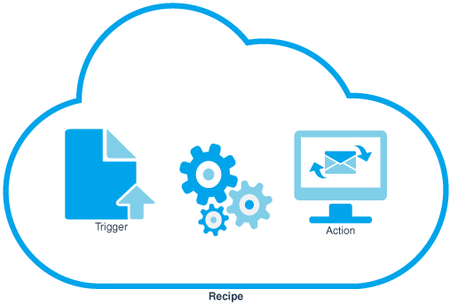

# Oracle Cloud Platform for Integration - Self Service Integration Workshop

> Updated: July 27th, 2018

## Journey To The Cloud: Oracle Cloud Platform for Integration - Self Service Integration Hands On Lab
A hands-on workshop to dive into development on Self Service Integration

## Overview
Enterprises can innovate faster, improve customer engagement, drive business-process efficiency, and accelerate digital transformation with Oracle Cloud. Oracle is the enterprise technology partner that positions companies for tomorrow, today; empowering businesses of all sizes on their journey of digital transformation. Oracle Cloud provides leading-edge capabilities in software as a service, platform as a service, infrastructure as a service, and data as a service.

At Oracle we have invested in delivering a plethora of new Cloud Services and we want to show you how simple – yet powerful they are. We specifically wanted to focus on low code, high productivity services that can be used in building enterprise grade solutions. We believe the best way to do this is to showcase a real world business solution comprised of these services. You will build the entire solution during the course of this workshop all in a stress-free fun environment. 

This workshop will focus on the Self Service Integration (SSI) capabilities within Oracle Cloud Platform for Integration Cloud.  Oracle Self-Service Integration (SSI) automates tasks between cloud applications. Improve your productivity and your collaborations by automating manual tasks without reliance on IT. Integrate Oracle apps with other popular cloud applications, or integrate between your other favorite cloud applications.

## About Self Service Integration Cloud Service

Oracle Self-Service Integration Cloud Service (SSI) lets you automate tasks and communicate with many different cloud applications, providing a cohesive workflow. SSI can be used by anyone who wants to be more efficient and productive by easily keeping track of contacts, documents, events, appointments, email lists, and more by coordinating the communications between cloud applications. SSI uses a process called a recipe that works by letting you specify a trigger, which is the part of the recipe that defines when the recipe is initiated, and the action, which is what the recipe does as a result of the trigger. SSI provides a shared catalog of recipes that you can copy. If you don’t find a recipe that meets your needs, then you can create your own recipe. 

## Self Service Integration Key Business Benefits

- Increase Line of Business productivity via recipe-based integration and delegate control to domain expertise owners
- Allow Line of Business App users to create integration recipes while IT focuses on the governance and control aspects of the end to end solution
- End to end recipe audit trails to comply with your most rigorous compliance and regulation controls
- Oracle Managed subscription-based recipe integration cloud service that enables instant access to create integrations

## Self Service Integration Cloud Service Features

- Increase Line of Business productivity via recipe-based integration and delegate control to domain expertise owners
- Allow Line of Business App users to create integration recipes while IT focuses on the governance and control aspects of the end to end solution
- End to end recipe audit trails to comply with your most rigorous compliance and regulation controls
- Oracle Managed subscription-based recipe integration cloud service that enables instant access to create integrations

## Hands-on Lab Overview

This hands-on lab will allow participants to do the following:
- Lab 100 - Configure a Recipe to add Google Contacts to Google Sheets

## Get Started: 
Open the navigation menu using the hamburger icon in the upper left of the menu bar to choose a lab guide and get started.

The hamburger menu has an icon that looks like this: 
