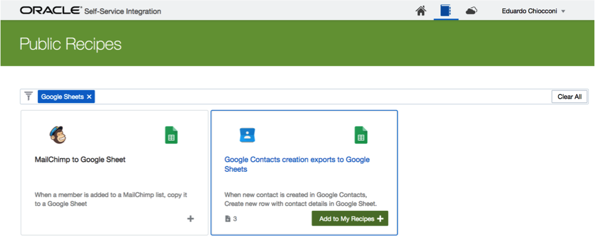
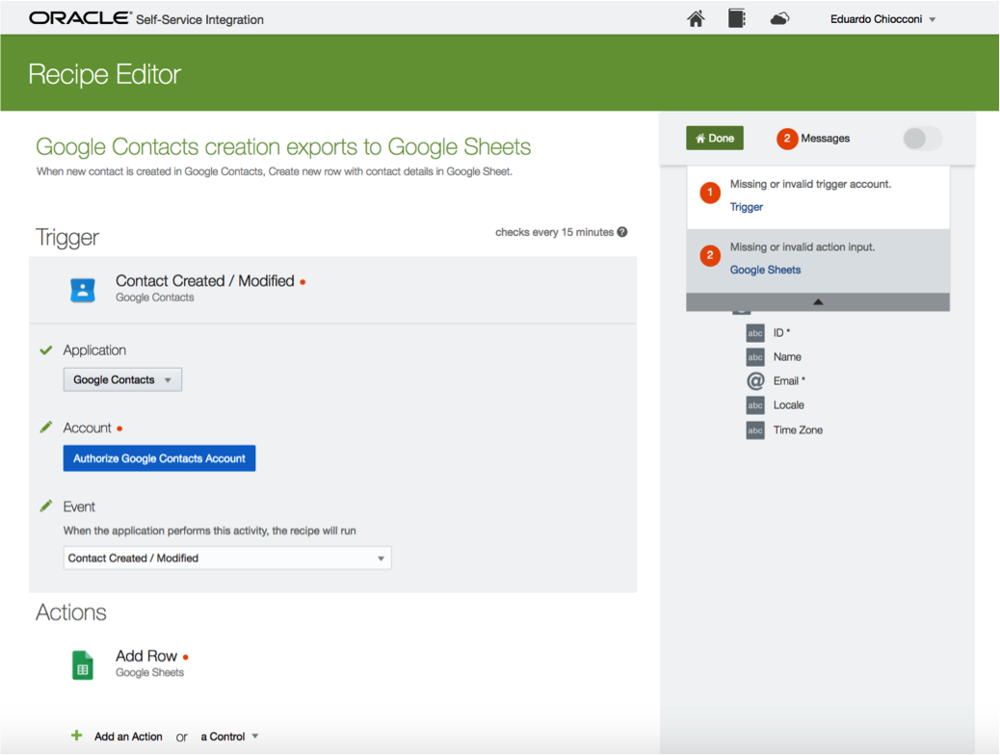
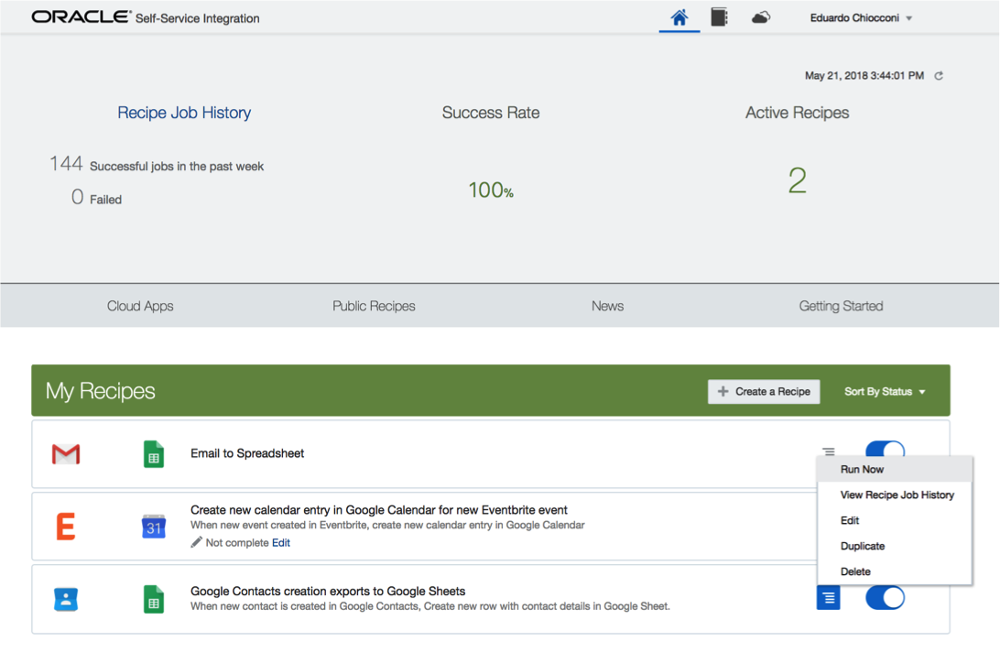
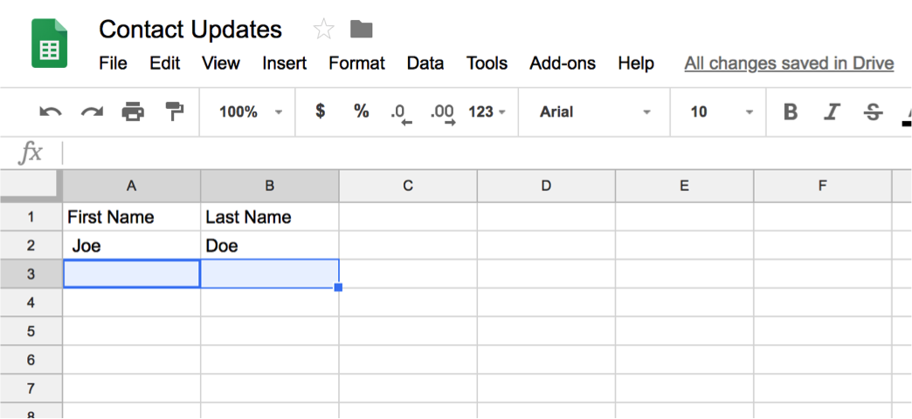
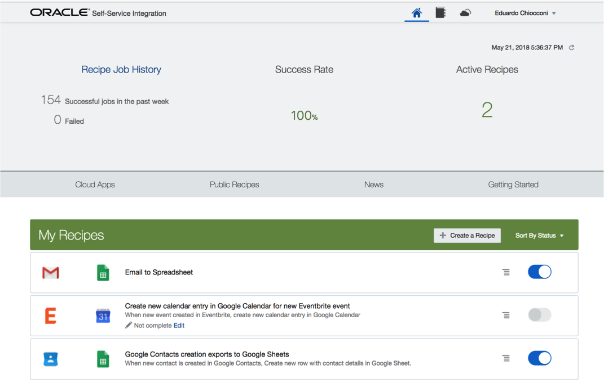
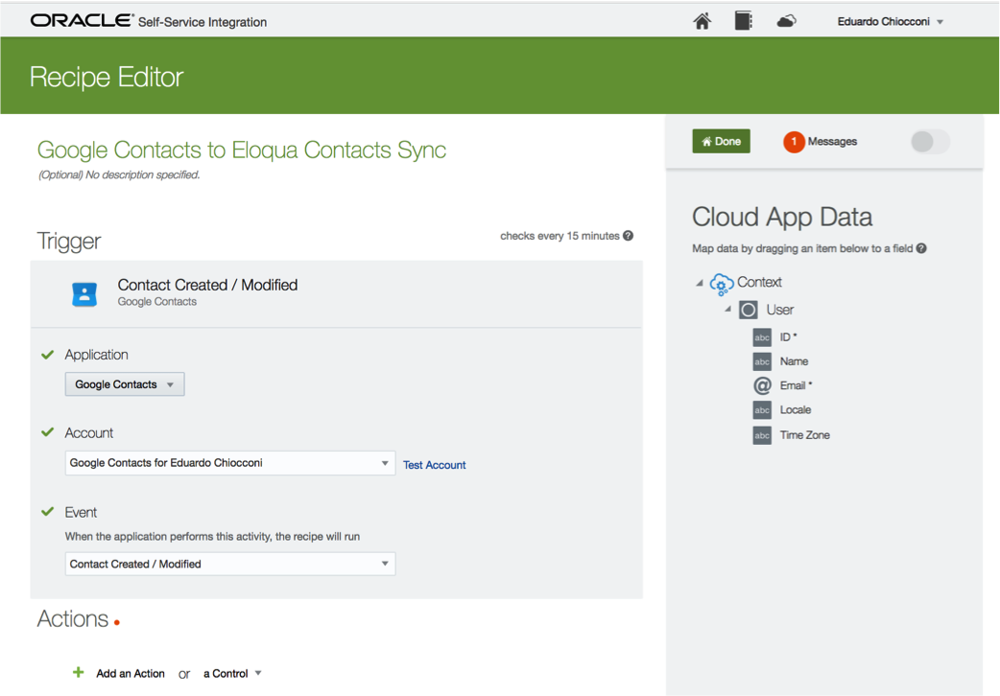
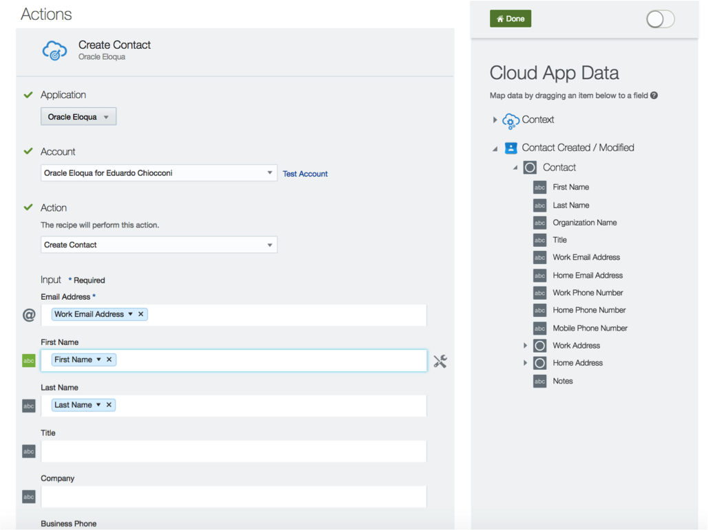
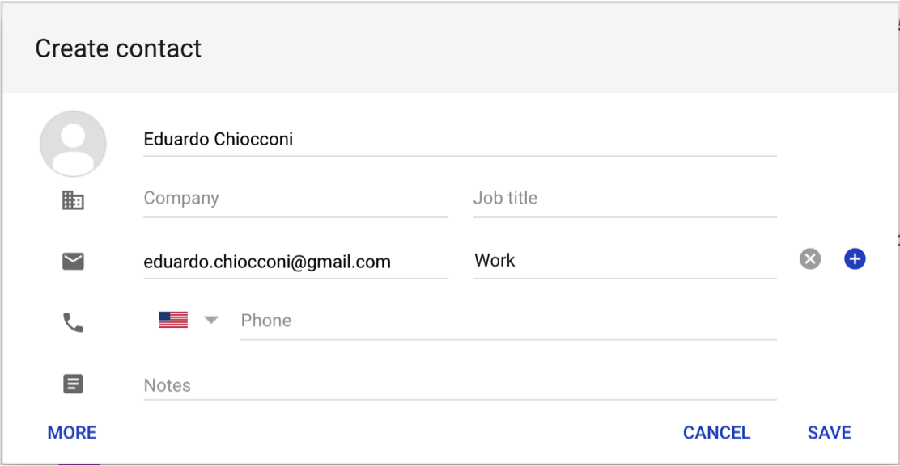
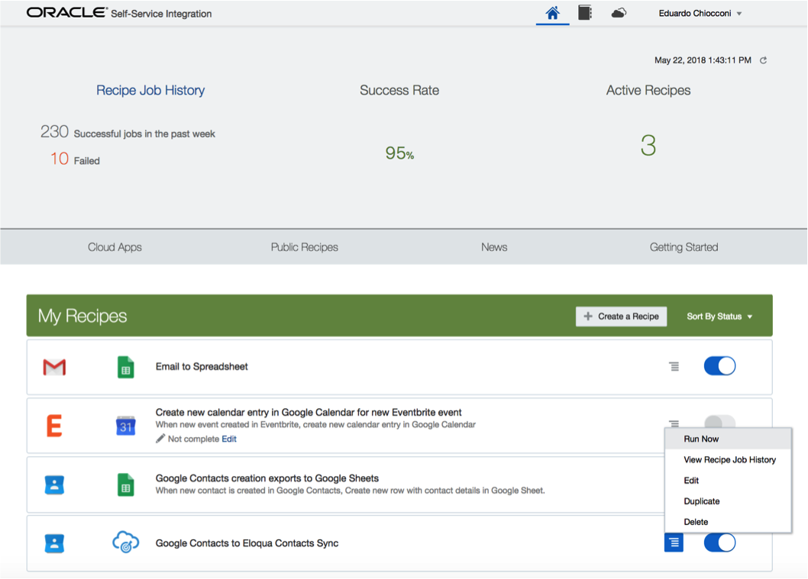
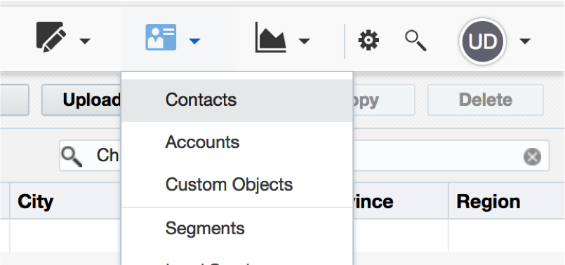

# Lab 200: Use SSI to create a Recipe that adds Google Contacts to Google Sheets

---

## Objectives

- In this Lab we are going to use Self Serevice Integration; referred to as SSI, to create a recipe that will take contacts (i.e., First Name and Last Name) that were added to Google Contacts and add them to a Google Sheets document.

## Required Artifacts

- The following lab.
- An Oracle Public Cloud account for SSI that will be supplied by your instructor.
- Google Account.
- Access to create Google Contacts.
- Access to create Google Sheets.
    Have a Sheet with 2 columns: First Name and Last Name

## Introduction

This lab is part of the **SSI Integration** workshop. 

As a result of this lab we seek to familiarize you with Oracle Self Service Integration (SSI) and hands-on experiance working with a recipe integration. We will explore the main parts of Self Service Integration (SSI). You will acquire a good overview of the Oracle Self Service Integration (SSI), an integration platform for Line of Business users. You will explore various consoles and capabilities to create recipes that bridge the gap and disconnect of personal productivity apps that need connectivity to your Enterprise systems of record. The exercise will get your familiar with all the tooling available to work with this cloud service. 

We’ll look at the following:
- SSI Dashboard
- SSI Public Recipes
- SSI Cloud Apps
- SSI My Accounts

Let’s start by logging into the Oracle Self Service Integration

## 1.1: Login

### **1.1.1**: Login to your Oracle Cloud account

---

**1.1.1.1** From your browser (Firefox or Chrome recommended) go to the SSI URL. 

**1.1.1.2** Enter your `User Name` and `Password` and click **Sign In**

***NOTE:*** the ** SSI URL, User Name and Password** values will be given to you by your instructor.

## Work with Oracle SSI Recipe Integration for Google Contacts to Google Sheets

## 1.2: Consume Existing Recipe

### **1.2.1**: Browsing Public Recipes

---

**1.2.1.1:**    Navigate to the “Public Recipes” and filter by “Google Sheets”

**1.2.1.2:**	Select “Google Contacts creation exports to Google Sheets” existing public recipe and click on the lower right hand side “+” icon to clone the recipe and install it on your account

 

### **1.2.2:**	Configure Recipe Trigger

---

**1.2.2.1:**    Define Authentication to Google Contacts by clicking on “Authorize Google Contacts Account”

**1.2.2.2:**	Select “Contact Created/Modified” as the event

 

#### **1.2.3:**	Configure Recipe Action

---

 

**1.2.3.1:**    Select or Create new Account Connection details (Account field)

**1.2.3.2:**	Select “Add Row” as the action to exercise on the Google Sheet

**1.2.3.3:**    Select the Google Folder where the Sheet resides (Parent Folder)

**1.2.3.4:**	Select the Google Sheet where we will add the contact as a row (Sheet)

**1.2.3.5:**	Start mapping values from left side payload to the fields below the Columns section

### **1.2.4:**	Activate Recipe

---

**1.2.4.1:**    Activate the upper right hand side toggle to activate the Recipe

 

### **1.2.5:**	Create Google Contact

---

**1.2.5.1:**    Create a new Contact in Google Contacts

 

### **1.2.6:**	Run Recipe

---

**1.2.6.1:**    On the SSI Home page, identify ”Contacts to Sheets” recipe and manually run it (rather than waiting for the recipe to run automatically)

 

### **1.2.7:**	Check new Row in Google Sheets

---

**1.2.7.1:**    Check the Google Sheet and you should see the new contact listed as a new row

 

## 1.3: Creating New Recipe

### **1.3.1:**	Recipe: Google Contacts to Eloqua Contacts Sync

---

## Pre-Requisites

- Access to Eloqua
    - URL: https://login.eloqua.com
    - ***NOTE:*** the ** Company Name, User Id and Password  will be given to you by your instructor.
- Access to Google Sheets
    - Have a Sheet with 2 columns: First Name and Last Name

## **1.3.1:**	Creating New Recipe

**1.3.1.1:**    Navigate to the “Home” and click on “Create a Recipe” button on the green toolbar

 

### **1.3.2:**	Creating New Recipe

---

**1.3.2.1:**   Provide a name to the new recipe: “Google Contacts to Eloqua Contacts Sync”
 
**1.3.2.2:**  Configure the Recipe Trigger by clicking on the “Application not selected” section of the Recipe trigger
  
**1.3.2.3:**   Select “Google Contacts” from the application chooser and you will end up with a similar result as shown on the left hand side screenshot 

 

### **1.3.3:**	Configure Recipe Action

---

**1.3.3.1:**   Select “Oracle Eloqua” as the Application
 
**1.3.3.2:**  Select or Create new Account Connection details (Account field)
  
**1.3.3.3:**  Select “Create Contact” as the action to create a new contact in Eloqua

**1.3.3.4:**  Start mapping fields for the first 3 input fields as shown in the screenshot on the left

 

### **1.3.4:**	Activate Recipe

---

**1.3.4.1:**   Activate the upper right hand side toggle to activate the Recipe

 

### **1.3.5:**	Create Google Contact

---

**1.3.5.1:**   Create a new Contact in Google Contacts

**1.3.5.2:**   For this exercise, enter your own First and Last Name as well as  your email address making sure you use the “Work” label (right text field to the email address field). Ensure you use ”Work” as otherwise, the recipe will fail

 

### **1.3.6:**	Run Recipe

---

**1.3.6.1:**   On the SSI Home page, identify ”Google Contacts to Eloqua Contacts Sync” recipe and manually run it (rather than waiting for the recipe to run automatically)

 

### **1.3.7:**	Check new Contact in Eloqua

---

**1.3.7.1:**   Log in Eloqua with the credentials provided by the instructor.
- URL: https://login.eloqua.com
- Company Name: `Instructor Provided`
- User:  `Instructor Provided`
- Password:  `Instructor Provided`
 
**1.3.7.2:**  Select ”Contacts” on the upper right hand side of the toolbar as shown on the screen on the left

 
  
**1.3.7.3:**  On the Search dialog enter your last name (followed by Enter) and then find the contact on the list as shown on the left hand side.

 

## **1.3.7:**	Challenge Exercise
- Recipe: Google Contacts to Eloqua Contacts Sync

    ## ** New Requirements **

    Conditionally create Eloqua Contacts for Google Mail (Gmail) accounts only

## 1.4: Consuming Integration and Process endpoints

### **1.4.1:**	Recipe: Reuse existing IT-Governed integrations and processes

---

## Pre-Requisites

- Oracle Autonomous Integration Cloud Instance (AIC Trials work!)
    - URL: OIC_Home_Instance_URL
    - User: YourUser
    - Password: YourPassword

### **1.4.2:**	Configure Process Endpoints

---

**1.4.2.1:**   On the SSI Home page, upper right hand side corner drop down click on the “My Cloud App Accounts”

**1.4.2.2:**  Click on the ”Authorize Cloud App Account” button
 
**1.4.2.3:**   Select “Oracle Process Cloud” from the list of Cloud Apps

**1.4.2.4:**  Provide correct values for the 3 form fields:
    - Username: valid AIC user id
    - Password: valid AIC user password
    - Service URL: valid AIC Home URL

 
 
 

### **1.4.3:**	Configure Process Endpoints

---

**1.4.3.1:**   On the SSI Home page, upper right hand side corner drop down click on the “My Cloud App Accounts”

**1.4.3.2:**  Click on the ”Authorize Cloud App Account” button
 
**1.4.3.3:**   Select “Oracle Integration Cloud” from the list of Cloud Apps

**1.4.3.4:**  Provide correct values for the 3 form fields:
    - Username: valid AIC user id
    - Password: valid AIC user password
    - Service URL: valid AIC Home URL

 
 
 

**1.4.3.5:**  You have now completed Lab 200 of the Oracle Self Service Integration workshop.
    - This Lab is now completed.

