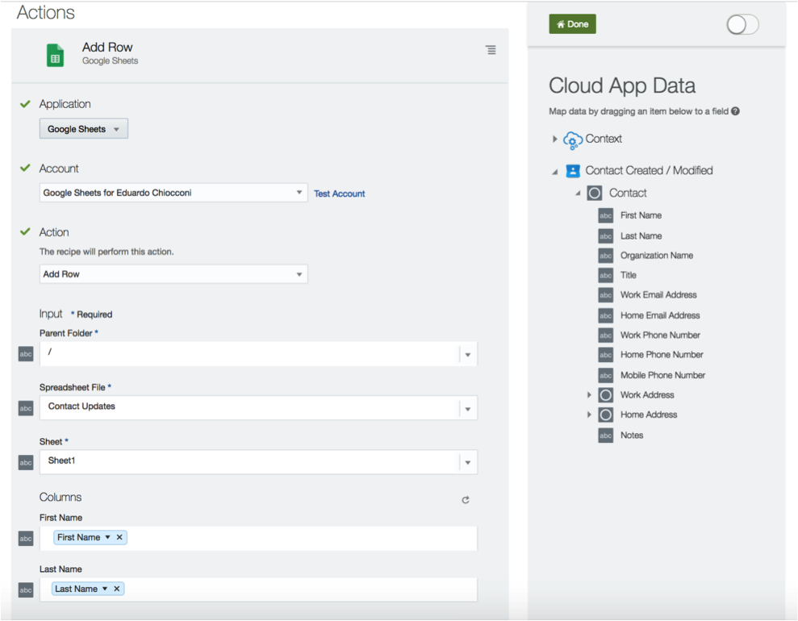
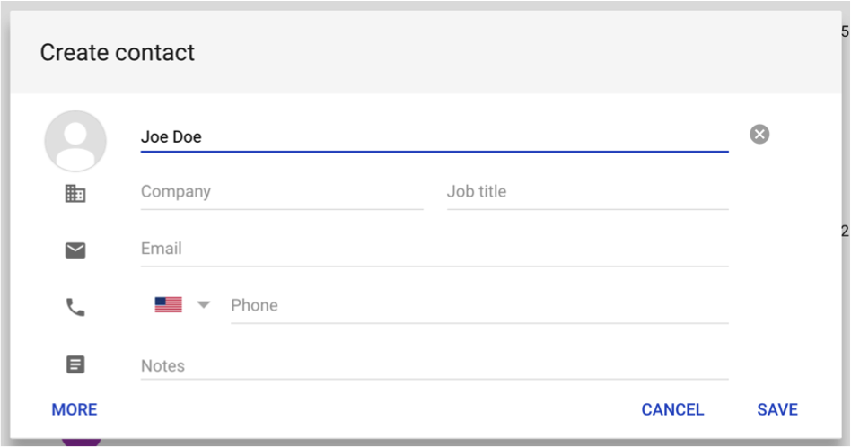

# Lab 100: Use SSI to create a Recipe that adds Google Contacts to Google Sheets

---

## Objectives

- In this Lab we are going to use Self Serevice Integration; referred to as SSI, to create a recipe that will take contacts (i.e., First Name and Last Name) that were added to Google Contacts and add them to a Google Sheets document.

## Required Artifacts

- The following lab.
- An Oracle Public Cloud account for SSI that will be supplied by your instructor.
- Google Account.
- Access to create Google Contacts.
- Access to create Google Sheets.
    Have a Sheet with 2 columns: First Name and Last Name

## Introduction

This lab is part of the **SSI Integration** workshop. 

As a result of this lab we seek to familiarize you with Oracle Self Service Integration (SSI) and hands-on experiance working with a recipe integration. We will explore the main parts of Self Service Integration (SSI). You will acquire a good overview of the Oracle Self Service Integration (SSI), an integration platform for Line of Business users. You will explore various consoles and capabilities to create recipes that bridge the gap and disconnect of personal productivity apps that need connectivity to your Enterprise systems of record. The exercise will get your familiar with all the tooling available to work with this cloud service. 

We’ll look at the following:
- SSI Dashboard
- SSI Public Recipes
- SSI Cloud Apps
- SSI My Accounts

## Work with Oracle SSI Recipe Integration for Google Contacts to Google Sheets

Let’s start by logging into the Oracle Self Service Integration

## 1.1: Login

### **1.1.1:** Login to your Oracle Cloud account

---

**1.1.1.1** From your browser (Firefox or Chrome recommended) go to the SSI URL. 

**1.1.1.2** Enter your `User Name` and `Password` and click **Sign In**

**NOTE:** the ** SSI URL, User Name, and Password ** values will be given to you by your instructor.

## 1.2: Consume Existing Recipe

### **1.2.1:** Browsing Public Recipes

---

**1.2.1.1:** Navigate to the “Public Recipes” and filter by “Google Sheets”

**1.2.1.2:** Select “Google Contacts creation exports to Google Sheets” existing public recipe and click on the lower right hand side “+” icon to clone the recipe and install it on your account

 

### **1.2.2:** Configure Recipe Trigger

---

**1.2.2.1:** Define Authentication to Google Contacts by clicking on “Authorize Google Contacts Account”

**1.2.2.2:** Select “Contact Created/Modified” as the event

 

### **1.2.3:** Configure Recipe Action

---

 

**1.2.3.1:**    Select or Create new Account Connection details (Account field)

**1.2.3.2:**	Select “Add Row” as the action to exercise on the Google Sheet

**1.2.3.3:**    Select the Google Folder where the Sheet resides (Parent Folder)

**1.2.3.4:**	Select the Google Sheet where we will add the contact as a row (Sheet)

**1.2.3.5:**	Start mapping values from left side payload to the fields below the Columns section.
Note: You must drag the "First Name" and "Last Name" from the right-hand side under "Cloud App Data" FROM the "Contact Created/Modified" section TO the "Columns" section under Actions on the left side.

### **1.2.4:**	Activate Recipe

---

**1.2.4.1:**    Activate the upper right hand side toggle to activate the Recipe

 

### **1.2.5:**	Create Google Contact

---

**1.2.5.1:**    Create a new Contact in Google Contacts

 

### **1.2.6:**	Run Recipe

---

**1.2.6.1:**    On the SSI Home page, identify ”Contacts to Sheets” recipe and manually run it (rather than waiting for the recipe to run automatically)

 

### **1.2.7:**	Check new Row in Google Sheets

---

**1.2.7.1:**    Check the Google Sheet and you should see the new contact listed as a new row

 

You have now completed Lab 100 of the Oracle Self Service Integration workshop.
​    - This Lab is now completed.

